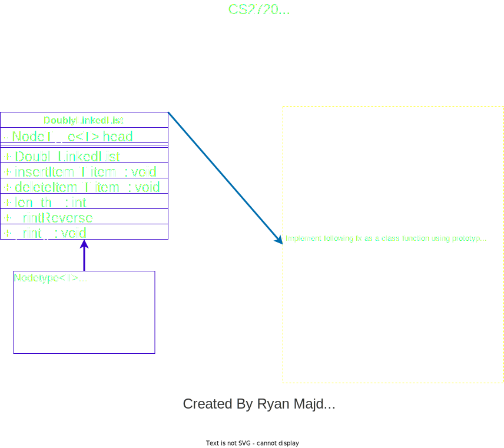

Ryan Majd & Maulik Durani | <rm97798@uga.edu> & <md00211@uga.edu>

    # doubly-linked-list assignment

    cs2720
    Dr. Jin Lu (Data Structures)

    # doubly Linked List Program

This Java program demonstrates the creation and manipulation of a generic doubly linked list, providing various operations on the list, including insertion, deletion, search, merging, finding intersections, and more.

## Table of Contents

- [Overview](#overview)
- [Usage](#usage)
- [Available Commands](#available-commands)
- [Big-O Complexity of Functions](#Big-O)

## Overview

### UML Diagram

## Usage

## Available Commands

The program supports the following commands:

## Big-O

- Add if necessary

## Temporary stuff to add:

In the readme file give the pseudo code (steps) for your deleteSubsection operation. Using this
pseudocode, explain the complexity (big O) of your deleteSubsection operation.
reverseList function - This function will return the reversed list. Use
the original list and change the “next” and “back” of nodes so that the
list is reversed. You are not allowed to create a new list that contains
the elements in the reverse order. You will get zero if you create a new
list and copy the elements in the reverse order in that list.
After Performing reverse of a list, if user wants to print reverse list
(by command ‘t’), In that case it has to consider reversed list as input
(Example Output 6- 1a and 1b for reference).
● Example 1:
○ Input list: 2 4 8 12 17 22 37
○ Reverse list: 37 22 17 12 8 4 2
• Example 2:
o Input List: 2
o Reverse List: 2
In the readme file give the pseudo code (steps) for your reverseList operation. Using this
pseudocode, explain the complexity (big O) of your reverseList operation.
swapAlternate function - This function will swap every other node in the
list. (For example: swaps nodes 1 and 2, nodes 3 and 4, nodes 5 and 6 and
so on)
Note: You are not allowed to create a new list for this function. Like the
reverseList function, modify the original list by changing the “next” and
“back” of nodes so that the nodes are swapped.
● Example:
○ Original List: 3 5 10 20 34 56
○ Modified List: 5 3 20 10 56 34
○ Reversed List: 34 56 10 20 3 5
● Note: If there is an odd number of nodes, do the swap all the way to
the last node and leave the last node at the end:
○ Original List: 45 67 89 102 120
○ Modified List: 67 45 102 89 120
○ Reversed List: 120 89 102 45 67
● Note: If the list is empty or has only one item then do nothing.
○ Original List:
○ Modified List:
○ Original List: 5
○ Modified List: 5
○ Reversed List: 5
In the readme file give the pseudo code (steps) for your swapAlt operation. Using this
pseudocode, explain the complexity (big O) of your swapAlt operation.
